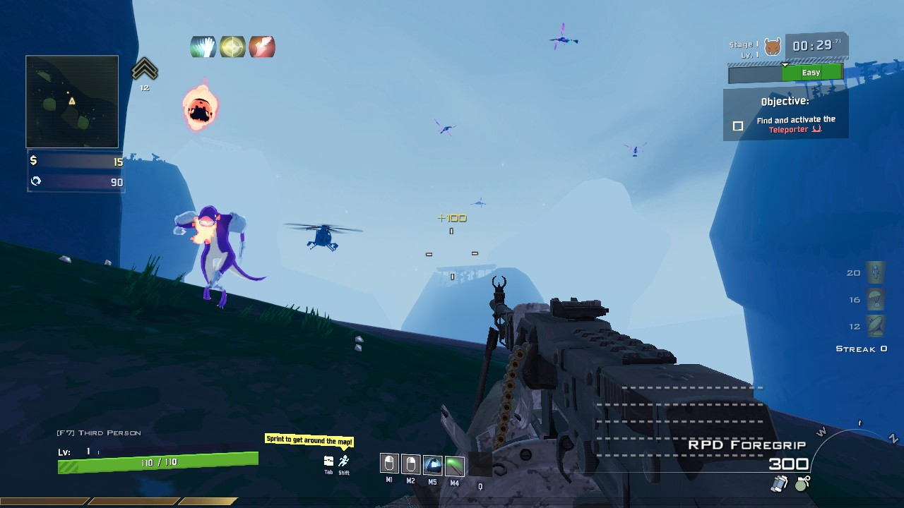
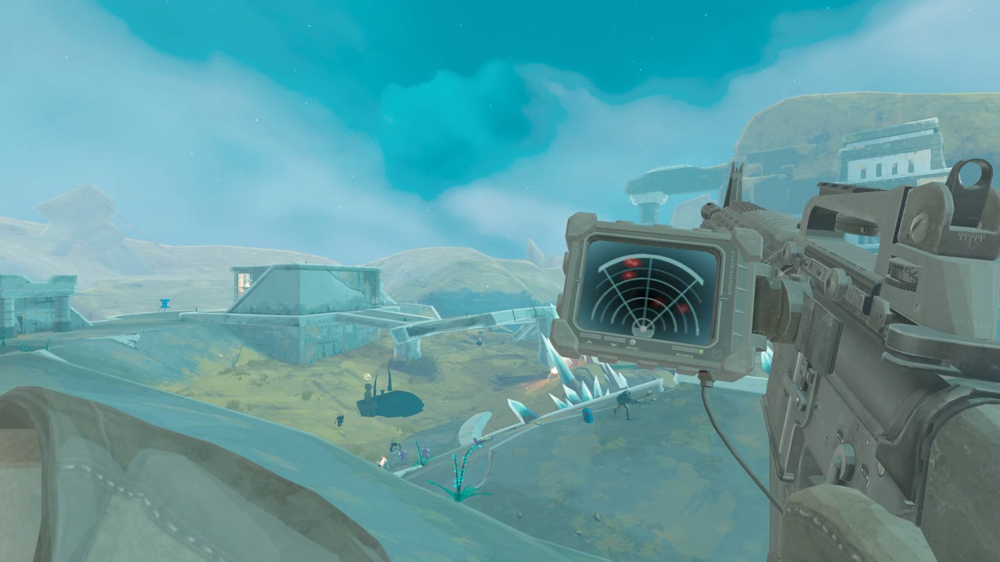
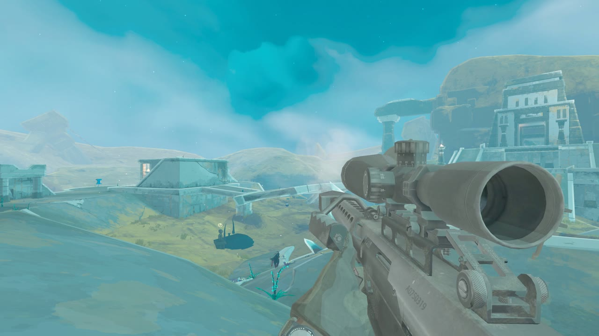
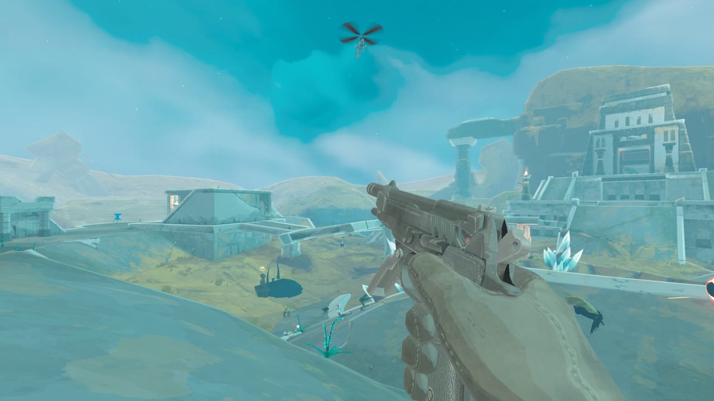

# MW2 x Risk of Rain 2

MW2 (2009) running inside Risk of Rain 2. You play the MW2 Soldier, a new survivor built out of MW2:
its movement, guns, viewmodel and animations, sounds, recoil, HUD and menus, all read from your own
copy of MW2. Risk of Rain 2 handles the damage, items and enemies, so your RoR2 items work off MW2
guns.

MW2 was made for small maps and small lobbies, not RoR2's huge stages and endless waves, so some of it is
tuned to play well there: you move faster and jump higher than in MW2, sprint never runs out, ammo
works RoR2-style, damage is scaled to RoR2's enemies and killstreaks take more kills. Each of those
is a setting you can change (see [Loadout and settings](#loadout-and-settings)).

https://github.com/user-attachments/assets/95c1cf51-5248-4b14-bf3f-a19d3c2d4766

The showcase reel (2 minutes; turn the sound on). Also as a
[download](https://github.com/buhhrad/MW2xRoR2/raw/main/docs/media/showcase.mp4) (9.5 MB MP4).

*What a run looks like: MW2's minimap and rank (top left), your perks as RoR2 items (top), your
killstreaks (right), weapon and ammo (bottom right), with RoR2's health, skills and objective as
usual.*

| | |
|---|---|
|  |  |

## What's in it

- MW2's guns with their attachments and camos, including akimbo, underbarrels, the riot shield and the knife lunge
- Create-a-Class through MW2's own menus. Perks and Pro perks show up as RoR2 items, and deathstreaks, Last Stand and One Man Army all work
- All 15 killstreaks: UAV on the minimap, Care Packages, the Predator, AC-130 and Chopper Gunner rides, Harriers, Pave Low, Stealth Bomber, EMP and the Nuke. Earned from kill streaks, or found as items in chests. Monsters can shoot your aircraft down
- MW2's full XP and rank system with its challenges and unlocks, saved across runs
- MW2's HUD and minimap, first person or third person, and your RoR2 items show on the soldier
- MW2's soldiers with every faction skin, MW2's death animation and death camera, and MW2's effects, sounds and announcer
- MW2's match start on the first stage: Choose Class, the countdown and the spawn music
- Co-op through normal RoR2 lobbies. Teammates see your soldier, your streaks and your aircraft

## What you need

- **Risk of Rain 2** and **Call of Duty: Modern Warfare 2 (2009)**, both on Steam (PC), with MW2's
  multiplayer content installed. No game files come with the mod: it reads your own MW2 install.
- Windows 10 or 11, 64-bit. No extra runtimes.
- Tested on RoR2 Steam build 25475991 (the October 8, 2026 update) and MW2 Multiplayer Steam build
  25374019.
- In co-op, everyone needs the same version of the mod. The lobby tells you if they don't match.

## Status

Experimental. What's been tested and what hasn't:

- Solo play is tested on Risk of Rain 2's October 8, 2026 update.
- Co-op was tested with 2 players before that update and hasn't been re-tested since. 3 and 4 player
  lobbies haven't been tested.
- It hasn't been tested alongside other mods. If something breaks with other mods installed, include
  your mod list when you report it.
- Windows only. Linux and Steam Deck (Proton) haven't been tested.
- Balance is still being tuned, and you can still snag on some RoR2 geometry (F6 gets you out).

## Install

**The Thunderstore listing is waiting for review.** Until it's up, install from
[Releases](../../releases) with one of the ways below. Once it's listed, any Risk of Rain 2 mod manager
can install and update it by searching for **MW2xRoR2**. The mod finds MW2 in your Steam libraries by
itself. Pick the MW2 Soldier on character select.

### r2modman or Thunderstore Mod Manager (until the listing is up)

1. Open the mod manager, pick **Risk of Rain 2** and a profile (a new one is fine).
2. Go to **Online**, search for **BepInExPack** (by bbepis) and click **Download**. A local mod doesn't
   bring its dependencies along, so this one comes first.
3. Download `MW2xRoR2-v<version>-thunderstore.zip` from [Releases](../../releases). Go to
   **Settings**, open the **Profile** tab, choose **Import local mod** and pick that zip.
4. Click **Start modded**.

When MW2xRoR2 is listed on Thunderstore, install it from **Online** instead, so you get updates.

### Gale

Wait for the Thunderstore listing (then: **Install mods**, search for **MW2xRoR2**, **Install**,
**Launch modded**), or use the manual install below.

### Manual (no mod manager)

1. Find your Risk of Rain 2 folder: in Steam, right-click Risk of Rain 2 > **Manage** > **Browse local
   files**.
2. Download [BepInExPack](https://thunderstore.io/c/riskofrain2/p/bbepis/BepInExPack/) with
   **Manual Download**. From its zip, extract what's inside the `BepInExPack` folder into your Risk of
   Rain 2 folder, so `winhttp.dll` sits next to `Risk of Rain 2.exe`.
3. Download `MW2xRoR2-v<version>-manual.zip` from [Releases](../../releases) and extract it into the
   same folder. The mod ends up in `BepInEx\plugins\MW2xRoR2`.
4. Start Risk of Rain 2 from Steam as usual.

To play without mods, rename `winhttp.dll` in the game folder (for example to `winhttp.dll.off`), and
rename it back to play with them.

### Updating

- Mod manager: update MW2xRoR2 from the manager's installed mods. Your settings and rank stay in the
  profile.
- Manual: extract the new manual zip over the old one.

## Controls

| Action | Key |
|---|---|
| Fire / aim down sights | RoR2's primary / secondary skill keys (left / right mouse by default) |
| Reload | R |
| Sprint (holds your breath while aiming) | your MW2 key (or RoR2's sprint key) |
| Crouch / prone | your MW2 keys (Left Ctrl / Z) |
| Primary / secondary weapon | 1 / 2 (your MW2 weapon-switch key works too) |
| Lethal (hold to cook) / tactical | your MW2 keys (G / F) |
| Knife | your MW2 key (V) |
| Underbarrel attachment | your MW2 key (3) |
| Use killstreak | your MW2 key (5) |
| Tactical Insertion | X (also RoR2's special-skill key, unless that's R) |
| Create-a-Class / Create-a-Streak (character select) | F3 / F5 |
| Change class (see below) | F4 |
| First / third person | F7 |
| MW2 mode off / on (to get unstuck) | F6 |

"Your MW2 key" means the mod reads your MW2 config (MW2's or IW4x's) and uses your own binds, so
they work like they did in MW2. The key in brackets is only for players without an MW2 config.

## Loadout and settings

**In the game.** On character select, the MW2 Soldier's Loadout tab has:

- **Skin**: MW2's faction soldiers.
- **Class**: your Create-a-Class classes and MW2's default classes. Create-a-Class (F3) is MW2's own
  menu: weapons, attachments, camos, perks, equipment and deathstreak.
- **Killstreaks**: your three streaks. Click to open Create-a-Streak (F5).
- **Rank**: your MW2 rank, plus **Unlock everything**. That switches to a separate profile with every
  weapon, attachment, camo, perk and killstreak; your own progress is kept apart.

In a run, F4 opens Choose Class, with MW2's rule: right after you spawn the new class is yours on the
spot, but once you've fought it comes with your next spawn (the next stage, a revive or a Tactical
Insertion). **One Man Army**, the MW2 Soldier's utility skill, is the mid-fight change. F7 switches
first / third person (you spawn in third person). RoR2's **Settings > Gameplay** has **MW2 First-Person FOV** (65-90) and **MW2 Third Person
Only**.

**In the config file.** Everything else is in `com.buhhrad.mw2ror2.cfg`. Open it from your mod
manager's config editor, or in `BepInEx\config\`, and edit it with the game closed. Every setting is
explained in the file; these are the ones you're most likely to want:

| Setting | Default | What it does |
|---|---|---|
| `[Keys]`, `[Equipment]`, `[MW2]`, `[Killstreaks]` key settings | see Controls | Rebind the mod's keys (F7 is fixed). Keys from your MW2 config win; set `[Keys] UseMw2Binds` to false to use these instead |
| `[Ammo] RoR2Ammo` | true | Guns never run out of reserve; launchers, grenades and tacticals recharge on cooldowns. Off: `[MW2] AmmoMode` (Scavenger, Infinite or Stock) |
| `[Killstreaks] KillScale` | 4 | Kills a streak needs, times MW2's (RoR2 sends far more enemies). 1 = MW2's |
| `[Killstreaks] ChestChance` | 0.05 | Chance a chest drops a killstreak instead of its item |
| `[Killstreaks] Faction` | US | Announcer voice: US, UK, NS, PG, RU or AB |
| `[Balance] DamageMultiplier` | 1.25 | Damage of every MW2 round (snipers, explosives and equipment have their own scales on top) |
| `[Balance] DamageTakenScale` | 1 | Damage you take from enemies |
| `[Balance] MoveSpeedBoost` | 1.45 | How much faster than MW2's own speed you move (RoR2's maps are big) |
| `[Balance] UnlimitedSprint` | true | Sprint never runs out |
| `[Balance] RegenDelay` | 0 | MW2 health regen after this many seconds unhurt. 0 = off, RoR2's healing only (MW2's was 5) |
| `[Progress] KillXpScale` | 0.1 | XP per kill as a share of MW2's 100 |
| `[MW2] Prematch` | true | MW2's match start on the first stage: Choose Class, countdown, no drop pod |
| `[MW2] WeaponVolume` | 0.35 | Volume of MW2's gun sounds |
| `[View] ThirdPersonStart` | true | Spawn in third person |
| `[General] SkipIntro` | true | Skip RoR2's opening cutscene |
| `[General] FlinchScale` | 0.35 | How hard your view jolts when you're hit (1 = MW2's) |
| `[MW2] CommonMpPath` | found through Steam | Where your MW2 is, if it's not in a Steam library |

## Something wrong?

- No MW2 Soldier on character select: the game started without mods. With a mod manager, launch
  with **Start modded** (r2modman, Thunderstore Mod Manager) or **Launch modded** (Gale), not from
  Steam. If it still happens, fully exit Steam
  (Steam menu > Exit), start it again and launch again.
- Stuck in the level: press **F6** to turn MW2 mode off, walk out with RoR2's movement, then press
  **F6** again to turn it back on.
- "MW2 not found" or "No MW2 weapons loaded" in the log: the mod looks through all your Steam
  libraries for MW2 and didn't find it. Check that MW2's multiplayer is installed, or set
  `CommonMpPath` in `com.buhhrad.mw2ror2.cfg` to your MW2 folder's `zone\<language>\common_mp.ff`.
- Anything else: close the game and attach `BepInEx\LogOutput.log` to an [issue](../../issues). With
  a mod manager it's in the profile's folder (the manager's settings can open it).

## What it does on your PC

- Reads your MW2 install's files. Nothing is copied out of them or changed.
- Writes only inside the `BepInEx` folder: its settings (`config\com.buhhrad.mw2ror2.cfg`), your MW2
  progress (`config\mw2-ror2\`) and its logs.
- If you get stuck in a level, it notes the spot in `mw2_stuck.log` and saves a screenshot of it to
  `mw2_stuck\` (at most 12 per session), so stuck spots can be reported and fixed.
- If the game freezes for 15 seconds, it writes a hang report (a copy of the log and a memory dump of
  the game) to `hangs\`.
- It makes no internet connections of its own. In co-op it talks to the other players through
  RoR2's own multiplayer.

None of it leaves your PC unless you attach it to an issue yourself.

## Build from source

You can read every line of the mod here, and build it yourself.

1. Install Rust (stable) and the .NET SDK.
2. Put BepInExPack (RoR2's, with `BepInEx\core`) in `deps\bepinexpack`. It isn't in the repo.
3. `cargo build --release -p mw2sim` builds `mw2sim.dll`. Cargo fetches the IW4L crates from
   [chasmlol/2010-rust-rewrite-mashup](https://github.com/chasmlol/2010-rust-rewrite-mashup) at a
   pinned commit.
4. `dotnet build plugin\MW2RoR2.csproj -c Release` builds `MW2RoR2.dll` against your own Risk of Rain
   2 install (pass `-p:RoR2Managed=<path>\Risk of Rain 2_Data\Managed` if it isn't in the default
   Steam folder).
5. Copy `target\release\mw2sim.dll` and `plugin\bin\Release\netstandard2.1\MW2RoR2.dll` over the
   ones in your install's plugin folder.

## Made with AI

buhhrad designed this mod, directed the work and playtested it. The code was written with an AI
coding agent (Anthropic's Claude, through Claude Code).

## Credits

- [IW4L](https://github.com/vladtrc/iw4L) by vladtrc, an open-source MW2 (2009) runtime written in Rust, through
  chasmlol's [2010 Rust Rewrite Mashup](https://github.com/chasmlol/2010-rust-rewrite-mashup) fork.
  The mod's movement, weapon, animation and data code is built on their crates (Apache-2.0).
- [BepInEx](https://github.com/BepInEx/BepInEx), [HarmonyX](https://github.com/BepInEx/HarmonyX) and
  the other libraries listed in `tools/installer/licenses/THIRD-PARTY.txt`.

## License

Source-available, not open source: read it, check it, play it, build it for yourself. Don't reupload
or redistribute it anywhere. See [LICENSE.md](LICENSE.md). Third-party parts keep their own licenses.

Not affiliated with or endorsed by Activision, Infinity Ward, Hopoo Games or Gearbox.
